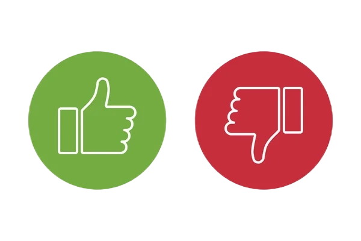

<div align="center">

## Comments Classification with Pre-trained Machine Learning Model



</div>

<br>

This project aims to perform comments classification on scraped comments from websites using a pre-trained machine learning model. The goal is to classify the comments as either positive or negative. We use streamlit to provide a user-friendly interface for scraping. 

### Overview

Sentiment analysis, also known as opinion mining, is the process of determining the sentiment or emotional tone expressed in a piece of text. In this project, we utilize the `BERT multilingual base model (cased)`, a pre-trained machine learning model from the BERT family, capable of processing text in several languages. We use it to classify comments into positive or negative sentiment. 

The sentiment analysis model is powered by the `transformers` library, developed by Hugging Face. More information about the library and available models can be found in the official documentation: [https://huggingface.co/transformers](https://huggingface.co/transformers)

The process involves the following steps:

1. Scraping comments from websites: We gather comments from various websites using web scraping techniques. These comments can be from product reviews, social media platforms, or any other sources containing textual user feedback.

2. Pre-processing: The scraped comments undergo pre-processing steps such as tokenization, normalization and truncation to prepare them for sentiment analysis.

3. Sentiment Analysis using the pre-trained model: we utilize the `BERT multilingual base model (cased)`, which is a multilingual transformer-based model pre-trained on a large corpus of text data. 

4. Classification and Visualization: The pre-trained model classifies the comments as positive or negative. We then use the results to create a bar chart and visualize the sentiment distribution.

### Installation

To run this project locally, follow these steps:

1. Clone the repository:
   ```
   git clone <project_link>
   ```

2. Install the required dependencies:
   ```
   pip install -r requirements.txt
   ```

3. Run the application (creates with [Streamlit](https://docs.streamlit.io/)):
   ```
   streamlit run app.py
   ```

### Usage

1. Enter the URL of the website you want to scrape comments from.
2. Specify the regex pattern to filter the comments.
3. Choose the HTML tag that contains the comments.
4. Click the "Scrape" button to start the scraping process.
5. The comments retrieved enabled us to visualize the breakdown Positive/Negative.

Feel free to experiment with different websites, regex patterns, and HTML tags to customize the scraping process.
